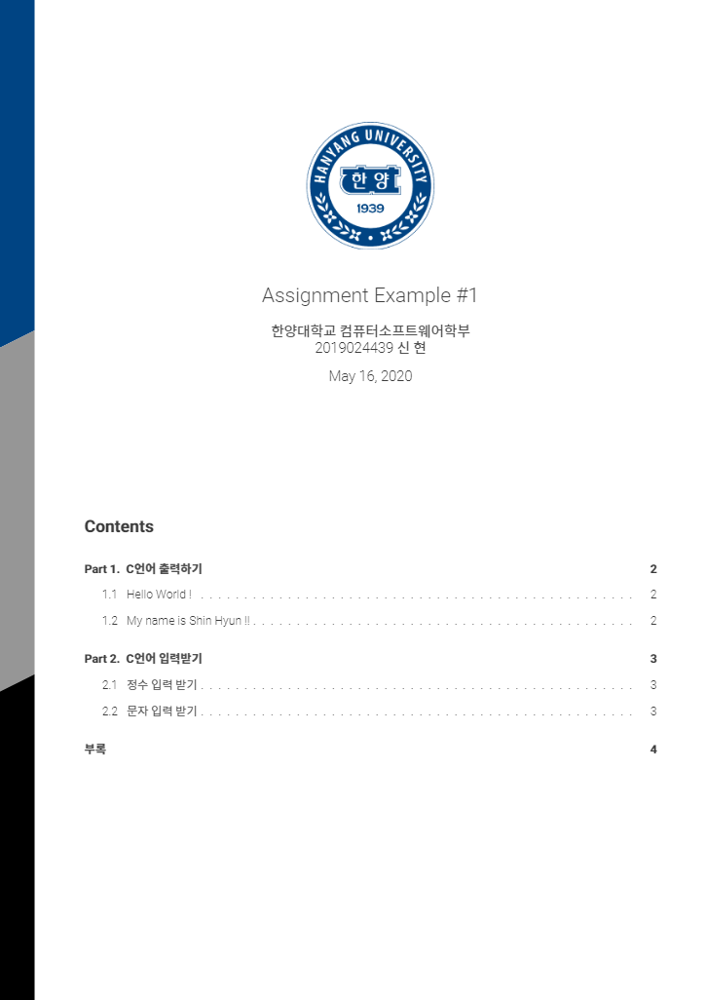
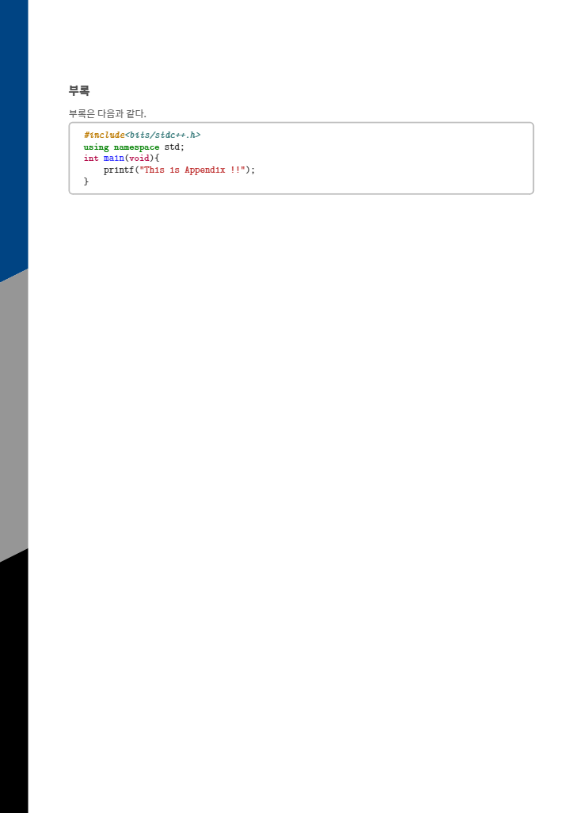

# Three Slash 

Three Slash TeX Design 

Academic Report Form, written in TeX.
Designed and Developed by Kyaryunha, All Rights Reserved.

[English]

A TeX document design (rendered below). 

You can find the [PDF here](https://github.com/kyaryunha/TeX-Design-Three-Slash/blob/master/ThreeSlashTeXDesign/main.pdf).
This is a template designed by me, used when I'm writing an essay in my university.
For this reason, its main theme is based on the color of my university. Feel free to change them if you need.
If you like this project, Please cite the source as:

You can use this at overleaf, change settings PDFTeX(default) -> XeTeX. 

[Korean]

아래와 같은 디자인의 TeX 코드입니다.

PDF 파일은 [여기](https://github.com/kyaryunha/TeX-Design-Three-Slash/blob/master/ThreeSlashTeXDesign/main.pdf) 에서 볼 수 있습니다.

본인이 대학교 과제 작성할 때 사용하는 템플릿으로 직접 디자인하였으며, 첨부된 예시로는 따라서 한양대학교 로고와 한양대학교 색깔이 들어가 있는데, 알아서 본인의 보고서에 맞게 변경하면 된다.

출처를 명시해주고 사용해주시면 감사합니다.

오버리프에서 사용할 수 있는데, 세팅을 PDFTeX에서 XeTeX로 변경해야 정상적으로 컴파일 됩니다. 

------

------

------

------

### TODO

- 용지 사이즈에 따라 디자인 수동으로 좌표 변경해야함
- 페이지 넘김시 \nextpage로 직접 넘겨줘야함 ( newpage나 자동으로 넘어가면, 왼쪽의 사선 디자인이 같이 안따라온다. )
- 로고 이미지 사이즈 바뀌어도 디자인 수동으로 변경해야함... ( 시험 끝나고 방학 중 언젠가 고칠 예정 ) 
